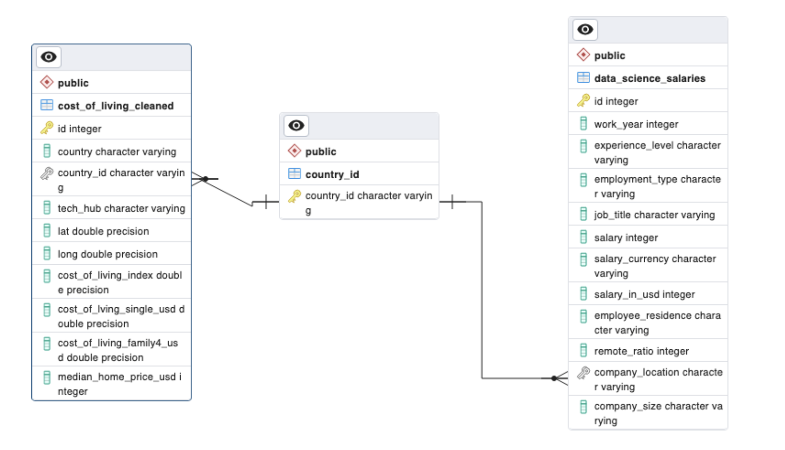
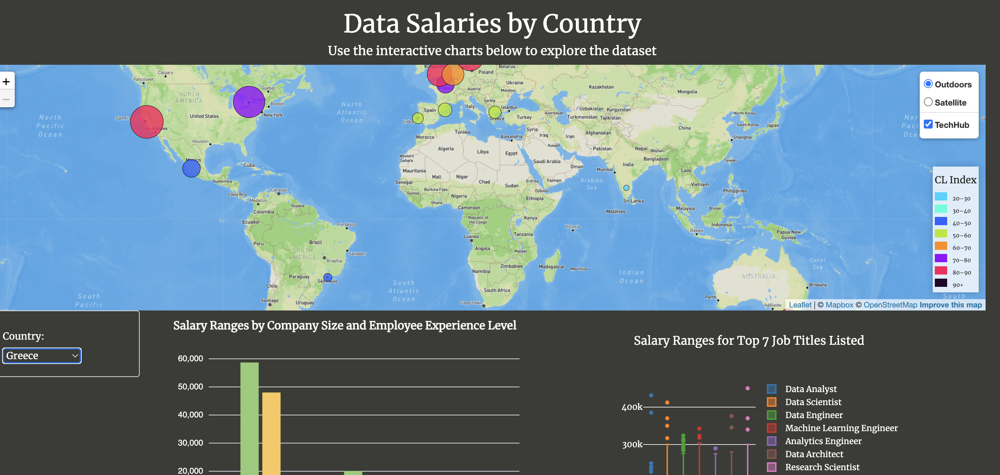
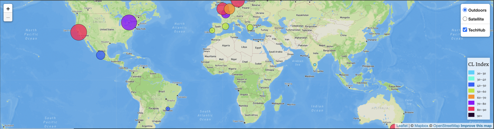
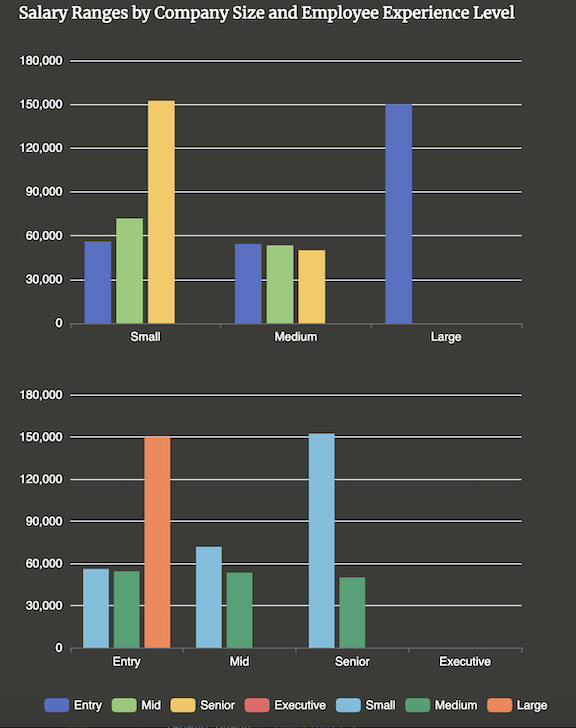
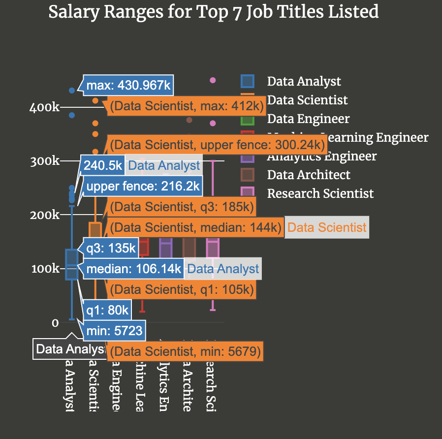

# Data Science Salaries

# Project 3: Group 4

## Team Members

Vidaya Gadaye, Sophia Felix, Jed Miller, Ashley Song

## Database Creation

To construct our database, we used the [Data Science Salaries 2023](https://www.kaggle.com/datasets/arnabchaki/data-science-salaries-2023) dataset from [Kaggle.com](https://www.kaggle.com/) for our salary data. In addition, we pulled cost of living data from [Numbeo.com](https://www.numbeo.com/cost-of-living/) to in include in our dataset. Finally, we used [Maps.ie](https://www.maps.ie/coordinates.html#:~:text=To%20find%20the%20exact%20GPS,marker%20to%20the%20precise%20position.) to get the lat and long coordinates for our tech hubs.

Once we had our data, we utilized a jupyter notebook to clean our data and export it as csv files to use in pgAdmin 4. We also created JSON files so team members could begin working with the data in javascript while our API was being constructed. Once the data was ready, we used pgAdmin 4 to create tables, populate the tables with the appropriate data, and then generate the queries needed for our data analysis. Below is the ERD graph.

## API Flask

With the csv files generated by our SQL queries as well as a self-built geoJSON file for our tech hubs, we built a flask API with routes for our different queries and a route to return the operating website.

## HTML, CSS, Javascript

With these packages, we built a functional webpage to showcase your interactive graphs.

## Data Visualization

The first visualization shows a map of the workd with thirteen tech hubs in different countries. The radius of the circle markers respresent the avg salaries of data science jobs in those countries while the color of the circle captures the cost of living index for each specific tech hub. A popup marker gives the data for avg salary, cost of living index, cost of living for individuals and families, and the median home price in the selected tech hub.

The second visualization shows the average salary of data science workers in a country based off the size of the country as well as the experience level of the employee. There are two graphs to represent these relationships on different axises. The graphs change whenever you select to view a different country.

The last visualization shows the range of salaries for the seven most listed jobs within our dataset. When you hover over a boxplot, it will give you the pertinent distribution reference points.

